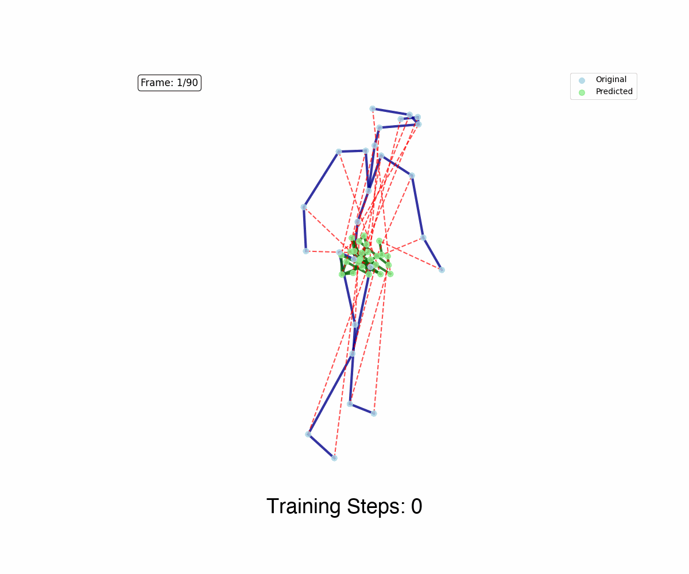

# GaitPredict

<p align="center">
  
</p>

Self-supervised gait representation learning from RGB-D skeleton sequences.
This repository accompanies the paper **"Self-supervised deep learning reveals Gait as a biomarker in the Human Phenotype Project"** and contains the model code, pre-computed downstream results, and all plotting scripts needed to reproduce the figures.

---

## Repository structure

```
GaitPredict-Paper/
├── model/
│   ├── architecture/          # DSTformer transformer backbone + ReconstructNet
│   ├── preprocessing/         # Dataset, augmentation, joint definitions
│   ├── training/              # Training loop, eval loop, configs, loss
│   └── inference/             # Embedding extraction scripts
├── plotting/
│   ├── publication_colors.py        # Shared color palettes and system renaming
│   ├── figure_1/                    # Training loss curve + biomarker system infographic
│   ├── figure_2/                    # Composite: sex-classification ROC + UMAP + ASBV grid
│   ├── figure_3/                    # Radar plot of Pearson r across body systems
│   ├── figure_4_grid/               # Figure 4 grid: gait-vs-confounders boxplots + biomarker bars
│   ├── figure_5_medical/            # Medical-condition dumbbell plots
│   ├── figure_6/                    # Composite: body-system masking heatmap + body-part panels
│   ├── extended_figure_1/           # Gait feature baseline boxplots
│   ├── extended_figure_2/           # Recording-duration scaling (intermittent overlay)
│   ├── extended_figure_4/           # Normalized-input vs GaitMAE absolute r gain
│   ├── extended_figure_5/           # Liver ultrasound: gait vs Age+BMI vs blood panel
│   ├── extended_figure_6/           # Composite: clinical-scenario sensitivity/AUC grid
│   ├── supp_figure_2/               # Stratified Δr (age/BMI strata) Figure-4-style grid
│   ├── supp_figure_3/               # Longitudinal next-visit significant improvements
│   ├── supp_figure_4/               # Lower-limb-only ablation grid (ASBV + Figure 4)
│   ├── supp_figure_5/               # Ancestry transfer / discrimination 2×2 grid
│   ├── supp_figure_6/               # Relatedness sensitivity (full vs unrelated-only)
│   ├── figure_4/  figure_4b/        # Legacy standalone panels (superseded by figure_4_grid)
│   └── …                            # composite figures keep their panel scripts in individual_plots/
├── results/                   # Pre-computed, de-identified CSV results (see below)
├── sample_data/               # Sample skeleton CSVs (smoke test + Figure-6 body-group poses)
├── requirements.txt
└── LICENSE
```

**`individual_plots/` convention.** Composite/grid figures (Figures 2, 4, 6 and Extended 6,
Supp 4) keep the scripts that render their constituent panels in an `individual_plots/`
subdirectory. The top-level script in each figure folder is the final assembler; it reads
the panels produced by the `individual_plots/` scripts and writes the published figure to
`output/`.

---

## Setup

```bash
pip install -r requirements.txt
```

Python 3.9+ recommended.

---

## Reproducing figures

Each script reads only from `results/` (and `sample_data/`) and writes PNG + PDF to its
figure's `output/` subdirectory. Run from the repo root.

**Single-script figures:**

```bash
python plotting/figure_1/loss_plot.py
python plotting/figure_1/gait_biomarker_infographic.py
python plotting/figure_3/radar_gait_only.py                  # Figure 3 + Extended Figure 3
python plotting/figure_4_grid/make_figure_4_grid.py          # Figure 4
python plotting/figure_5_medical/medical_conditions_dumbbell.py
python plotting/extended_figure_1/publication_figure_gm.py
python plotting/extended_figure_2/plot_intermittent_overlay.py
python plotting/extended_figure_4/normalized_vs_gaitmae_absolute_r_gain.py
python plotting/extended_figure_5/plot_liver_gait_vs_bloodpanel.py
python plotting/supp_figure_2/stratified_subgroup_delta_r.py
python plotting/supp_figure_3/plot_longitudinal_significant_improvements.py
python plotting/supp_figure_4/grid_asbv_figure4.py
python plotting/supp_figure_5/plot_ancestry_2x2_grid.py
python plotting/supp_figure_6/plot_relatedness_delta_bars.py
```

**Composite figures** — render the panels first, then the assembler:

```bash
# Figure 2
python plotting/figure_2/individual_plots/plot_gender_roc.py
python plotting/figure_2/individual_plots/umap_activity_embeddings.py
python plotting/figure_2/individual_plots/plot_asbv.py
python plotting/figure_2/make_figure_2_composite.py

# Figure 6
python plotting/figure_6/individual_plots/plot_body_system_heatmap.py
python plotting/figure_6/individual_plots/plot_grouped_by_body_part.py --metric pearson
python plotting/figure_6/make_figure_6_composite.py

# Extended Figure 6
python plotting/extended_figure_6/individual_plots/make_clinical_scenario_panels.py
python plotting/extended_figure_6/make_clinical_scenario_grid.py
```

---

## Results CSVs

All result tables are **de-identified, plot-ready aggregates** (per-system / per-seed
summary statistics). No subject-level predictions, raw skeletons, or identifiers are
distributed.

| File | Figure(s) | Description |
|------|-----------|-------------|
| `gait_only_pearson.csv` | 3, ext 3 | Pearson r: gait model vs no-confounder baseline, all systems |
| `gait_vs_confounders_pearson.csv` | 4, ext 1 | Pearson r: gait model vs Age/BMI/Height/VAT baseline |
| `figure4b_seed_std.csv`, `figure4_grid_seed_values.csv` | 4 | Per-seed values for the Figure-4 biomarker bars |
| `medical_conditions_pearson.csv` | 5 | AUC for medical-condition / medication classification |
| `medical_conditions_n_positive.csv`, `medical_conditions_seed_auc.csv` | 5 | Gender-specific positive counts + per-seed AUC for the dumbbell |
| `masking_ablation_pearson.csv` | 6 | Body-system joint-masking ablation Pearson r |
| `masking_strategy_ablation_age.csv` | — | Pretraining masking-strategy ablation (age, per sex): full / no-frame / no-group / no-noise / noise-only |
| `roc_gender.csv`, `umap_embeddings.csv`, `asbv_metrics.csv`, `movement_features_asbv.csv` | 2 | ROC curve points, 2D UMAP coords, ASBV metrics, movement-feature baseline |
| `wandb_training_loss.csv` | 1 | W&B training-loss export |
| `duration_scaling_plot_data.csv`, `duration_scaling_intermittent_plot_data.csv` | ext 2 | Recording-duration scaling curves + intermittent-sampling seed values |
| `normalized_vs_gaitmae_gains.csv` | ext 4 | Per-target absolute r gain: GaitMAE vs normalized-keypoint baseline |
| `liver_predictive_power_summary.csv`, `liver_perseed_pearson.csv` | ext 5 | Liver prediction: per-source mean/std + per-seed Pearson r |
| `clinical_sensitivity_top10_table.csv`, `clinical_utility_by_gender_table.csv`, `clinical_scenario_seed_auc.csv` | ext 6 | Clinical-scenario sensitivity/utility tables + per-seed AUC |
| `stratified_subgroup_delta_r_fdr.csv`, `stratified_subgroup_delta_r_feature_level_fdr.csv` | supp 2 | Per-system and per-feature stratified Δr (age/BMI strata) |
| `longitudinal_supp_fig3_pearson.csv` | supp 3 | Longitudinal next-visit significant-improvement bars + seed scatter |
| `lower_body9_asbv_pearson.csv`, `asbv_only_gait_pearson.csv`, `lower_body9_full_pearson.csv`, `lower_body9_asbv_seed_values.csv` | supp 4 | Lower-limb-only ablation comparisons + per-seed values |
| `ancestry_*` (5 files) | supp 5 | Genetic-PCA subset + cross-/within-ancestry transfer + BMI discrimination summaries |
| `relatedness_per_seed_deltas.csv` | supp 6 | Per-seed Δr (full cohort vs unrelated-only) for three anchor phenotypes |

---

## Model

The model is a **DSTformer** (Dual-Stream Transformer) trained with a masked reconstruction objective on 3D skeleton sequences. Input: `(batch, time, joints, 3)` XYZ coordinates. Output: reconstructed joint positions used for self-supervised pre-training.

### Training (requires your own data)

```bash
python -m model.training.nonsweep_main
```

Configuration is in `model/training/default_config.py` (`LONG_CONFIG` is the main config used in the paper).

### Extracting embeddings

```bash
python -m model.inference.extract_and_eval
```

### Smoke test

```bash
python -m model.training.nonsweep_main --smoke_test
```

Uses the sample skeleton in `sample_data/`.

---

## License

MIT — see [LICENSE](LICENSE).
